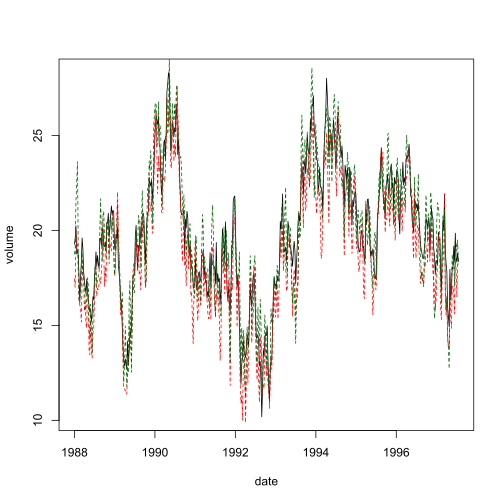

<hr>

# Point Forecast Evaluation {.tabset .container}

<hr>


## Introduction

<hr>

* See @Diebold2017Forecasting (Note, this is based on Edition 2017 Version Tuesday 1st August, 2017)
* See Part IV Forecast Evaluation and Combination
* See Chapter 10 Point Forecast Evaluation

<hr>

## Descriptive Analysis

<hr>

<!--..........................................................................-->
<button type="button" class="collapsible"> *Show Code* </button>
<div class="content">


```r
# load data set

data <- read.delim("./data/fcst12input.dat", header = TRUE, sep="\t") 

data$DATE <- seq.Date(from = as.Date("1988-01-01"), to = as.Date("1997-07-24"), by = "week")
```

</div>
<!--..........................................................................-->

<!--..........................................................................-->
<button type="button" class="collapsible"> *Show Code* </button>
<div class="content">


```r
# load data set
plot(data$DATE, data$VOL, type = "l", xlab = "date", ylab = "volume")
lines(data$DATE, data$VOLJ, lty = 2, col = "red")
lines(data$DATE, data$VOLQ, lty = 2, col = "darkgreen")
```

</div>
<!--..........................................................................-->
<button type="button" class="collapsible"> *Show Output* </button>
<div class="content">



</div>
<!--..........................................................................-->

Calculate forecast errors for the judgmental `VOLJ` and the quantitative `VOLQ` forecast errors.

<!--..........................................................................-->
<button type="button" class="collapsible"> *Show Code* </button>
<div class="content">


```r
# calculate forecast errors
data$EJ <- data$VOL - data$VOLJ
data$EQ <- data$VOL - data$VOLQ
```

</div>
<!--..........................................................................-->

<hr>

## Inferential Analysis

<hr>

Regression of the forecast errors on a constant and an MA(1) disturbance.

<!--..........................................................................-->
<button type="button" class="collapsible"> *Show Code* </button>
<div class="content">


```r
# regression...
reg.res.q <- arima(data$EQ, order = c(0, 0, 1), method = "CSS-ML")
reg.res.q$coef
reg.res.q <- arima(data$EQ, order = c(0, 0, 1), method = "ML")
reg.res.q$coef
reg.res.q <- arima(data$EQ, order = c(0, 0, 1), method = "CSS")
reg.res.q$coef
```

</div>
<!--..........................................................................-->

<hr>

## References {.container}

<hr>
